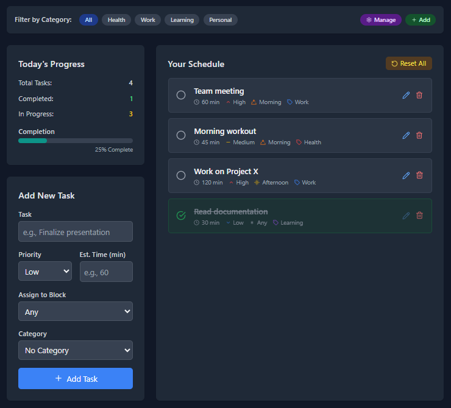

# DayWise - Task Management Application

DayWise is a web-based task management application built with Flask that helps users organize their daily tasks with time blocks, priorities, and progress tracking.



## Live Demo

The application is live and can be accessed at: [https://zold.pythonanywhere.com](https://zold.pythonanywhere.com)

## Features

- **User Authentication**: Secure login and registration system
- **Task Management**: Create, edit, and delete tasks
- **Time Blocks**: Organize tasks by morning, afternoon, evening, or any time
- **Priority Levels**: Set low, medium, or high priorities for tasks
- **Progress Tracking**: Monitor your daily task completion progress
- **Dark Mode**: Toggle between light and dark themes for comfortable viewing
- **Responsive Design**: Works on desktop and mobile devices

## Technologies Used

- **Backend**: Flask, SQLAlchemy
- **Frontend**: HTML, Tailwind CSS, JavaScript
- **Database**: SQLite
- **Authentication**: Flask-Login

## Installation

1. Clone the repository:

``` bash
git clone https://github.com/AhmedOsamaMath/daywise.git
cd daywise
```

2. Install the required packages:

``` bash
pip install -r requirements.txt
```

## Usage

1. Start the application:

``` bash
flask run
```

2. Open your browser and navigate to `http://127.0.0.1:5000/`

3. Register a new account or log in with existing credentials

4. Start managing your tasks!

## Project Structure

```
daywise/
├── app.py                 # Main application file
├── templates/             # HTML templates
│   ├── base.html          # Base template with common elements
│   ├── dashboard.html     # Main dashboard view
│   ├── index.html         # Landing page
│   ├── login.html         # Login page
│   └── register.html      # Registration page
├── static/                # Static files (if any)
├── instance/              # Contains the SQLite database
└── requirements.txt       # Project dependencies
```

## Contributing

Contributions are welcome! Please feel free to submit a Pull Request.

## License

This project is licensed under the MIT License. See the [LICENSE](./LICENSE) file for more details.
